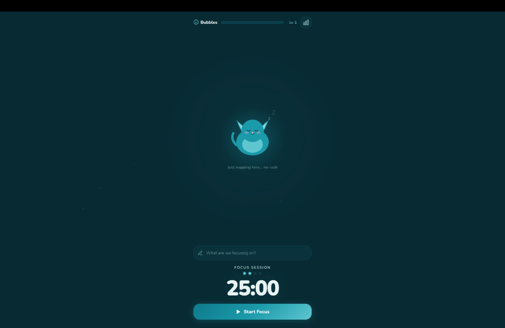
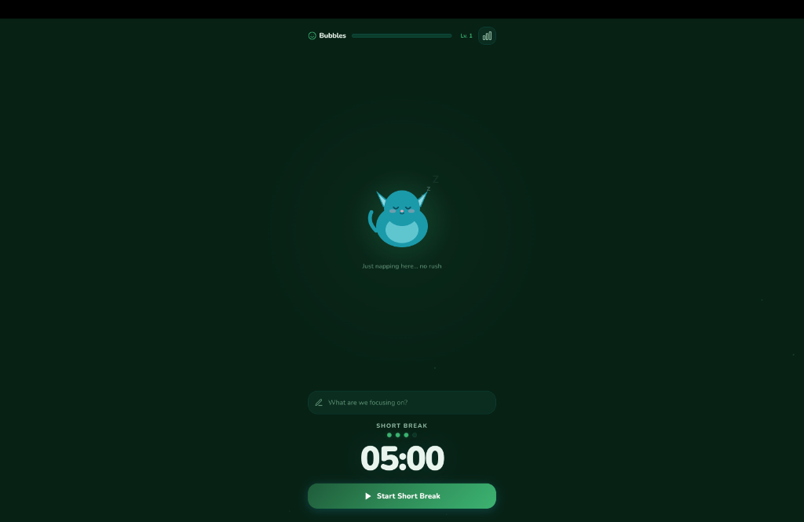
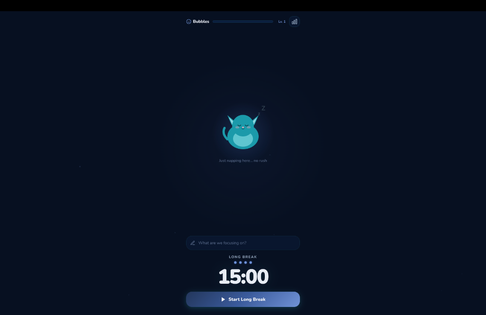

<div align="center">
  <h1>Focus Pet 🐾</h1>
  <p><b>A cozy, Pomodoro timer to help you stay productive.</b></p>
  
  [](https://Husse06.github.io/Focus/)
</div>

<br>

Focus Pet is a beautifully designed, Pomodoro timer built to make studying and working more enjoyable. By pairing the proven Pomodoro technique with a virtual pet companion that levels up as you focus, this app turns productivity into a rewarding journey.

<br>

<p align="center">
  
  
  
</p>

---

## Features

- **🍅 Classic Pomodoro Flow**: 25-minute focus sessions, 5-minute short breaks, and a 15-minute long break after 4 consecutive sessions.
- **XP**: Earn Experience Points (XP) for every successful focus session to level up your virtual pet.
- **Virtual Companion**: Your pet reacts to your focus state—sleeping on breaks, cheering you on while working, and reacting to skipped or failed tasks.
- **Cozy UI/UX**: A beautifully crafted "Soft Dark Mode" featuring fluid animations, glowing cursor effects, and glassmorphism styling.
- **Local Storage Persistence**: Your pet's name, level, XP, and stats are securely saved in your browser locally. All privacy, no databases required.

## Built With

Focus Pet is a lightweight frontend application built entirely without heavy frontend UI libraries to demonstrate strong fundamental JavaScript and CSS skills.

- **HTML5 & Vanilla CSS**: Utilizing modern CSS properties like Custom Properties (Variables), Flexbox, Animations, and Backdrop-filters for the glass effect.
- **Vanilla JavaScript**: All state management, DOM manipulation, and timer logic are handled natively.
- **Vite**: Used as the frontend build tool for a fast, optimized development experience and quick bundling for production.

## Live Demo

You can try the app right now straight from your browser:  
👉 **[Play Focus Pet](https://Husse06.github.io/Focus/)**

## Local Installation

If you want to run this project locally, explore the code, or contribute:

1. **Clone the repository**
   ```bash
   git clone https://github.com/Husse06/Focus.git
   cd Focus
   ```

2. **Install dependencies**
   ```bash
   npm install
   ```

3. **Start the development server**
   ```bash
   npm run dev
   ```

4. Open `http://localhost:5173` in your browser.

## Future Roadmap

- [ ] Add sound effects for session completions.
- [ ] Implement varied pet avatars (Cat, Dog, Slime, etc.).
- [ ] Add custom timer lengths for power users.
- [ ] Detailed historical charts & graphs.

## Author
- GitHub: [@Husse06](https://github.com/Husse06)

